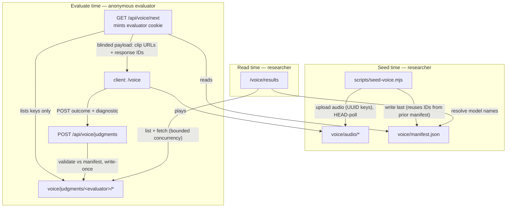

# feat: Voice Arena POC — blinded pairwise voice-model comparison

## Summary

Add a second arena to this app: a blinded, pairwise evaluation experience where an anonymous evaluator hears a spoken prompt, listens to two anonymized voice-model response clips, votes A / B / Tie / Both bad, answers one diagnostic question, and repeats across a short session. A seed script loads prompts and response clips; a results page shows win/loss/tie/both-bad rates per model pair. Everything lives in a new `app/voice/` + `lib/voice-*` namespace sharing only the app shell and storage patterns — no coupling to the existing submission/run/judge domain.

## Problem Frame

The repo today evaluates coding harnesses with an automated judge. The product direction is a multi-modal evaluation platform, and the next modality is voice: can short, blinded pairwise comparisons produce useful voice-model preferences? This POC builds the product-shaped slice of that experiment — effortless voting with honest data capture — deliberately excluding the full research instrument (study versioning, attention checks, audit trails, holdout sets).

---

## Requirements

**Evaluator experience**

- R1. `/voice` serves a blinded comparison: prompt audio (+ transcript when present) and two response clips, A/B display order randomized server-side, with no model identity anywhere in a client-visible payload — including blob URLs, which are keyed by UUIDs.
- R2. The evaluator votes A / B / Tie / Both bad, then answers one single-select diagnostic ("What most influenced your choice?": better answer / more natural voice / better tone or emotion / better pacing / better pronunciation / more concise / other / not sure), optionally adds free text, and submitting advances to the next comparison.
- R3. Either clip can be replayed; per-clip play counts and time-to-judgment are tracked client-side and stored with the judgment. Voting is never gated on playback.
- R4. Progress renders per batch of 10 (capped at remaining count). When the evaluator has judged every available comparison, `/voice` shows a terminal "done" state; when nothing is seeded, a "not seeded" state. A pending state renders while the next comparison is being fetched (initial load and between judgments) — the most-repeated moment in the flow must not flash blank or jump layout.
- R5. If a clip fails to load, the UI offers retry (re-requests the same clip URL) and a Skip that advances without writing a judgment (session-local exclude only).

**Data integrity**

- R6. Evaluator identity is a pseudonymous UUID in an httpOnly cookie, minted server-side by `GET /api/voice/next` when absent. The cookie value is validated as a UUID before use; a malformed value is treated as absent (re-mint on GET, reject on POST). `POST /api/voice/judgments` requires the cookie and returns 401 without it (body names the fix: call `GET /api/voice/next`); identity supplied in a request body is ignored.
- R7. Each judgment is one immutable blob at `voice/judgments/<evaluatorId>/<comparisonId>.json` (`comparisonId` = the two response IDs sorted and joined, `allowOverwrite: false`). A duplicate submit returns success without a second write; any non-duplicate write failure surfaces as a 5xx, never as a silent success.
- R8. A judgment stores both response IDs in display order plus the outcome verbatim. The server validates that both IDs exist in the manifest, belong to the same prompt, and resolve to two distinct models before writing (400 otherwise).
- R9. `POST /api/voice/judgments` applies the abuse guards the submissions route already uses: content-type and body-size checks, a free-text length cap (2000 chars, enforced in the Zod schema), and an in-memory per-IP rate limit sized generously above a legitimate session (~120/hour). `GET /api/voice/next` applies a looser per-IP cap on cookie minting.

**Researcher / admin**

- R10. `scripts/seed-voice.mjs` uploads prompt and response audio from a local manifest, HEAD-polls each uploaded URL until readable, then writes `voice/manifest.json` last as the commit marker. Re-seeding preserves the IDs (and therefore collected judgments) of unchanged entries. A `--fixtures` mode generates distinguishable tone WAVs so the arena is exercisable with no real TTS clips.
- R11. `/voice/results` shows, per canonical model pair, win/loss/tie/both-bad counts and rates plus total judgment count, revealing model names. Judgments referencing response IDs missing from the current manifest are skipped and reported as an orphan count; judgments that could not be fetched are skipped and reported as an unreadable count.

**Non-functional**

- R12. All app-runtime voice Blob I/O (routes and pages) goes through a `VoiceStorage` layer with the retry/skip semantics of `lib/storage.ts`, a `MemoryStorage`-style implementation, and the shared-ref test seam. The seed script is a standalone node process that calls `@vercel/blob` directly; its output is Zod-validated at read time by `getManifest()`.
- R13. The header nav gains a "Voice" link.

---

## Key Technical Decisions

- **Separate `VoiceStorage` interface, not an extension of `Storage`**: keeps the voice domain decoupled from the harness domain (user decision). `withRetry` and `fetchJson` are exported from `lib/storage.ts` and reused so voice inherits the production-verified Blob hardening (eventual consistency, HTML error pages, rate limits — see `lib/storage.ts:92-127`).
- **Deterministic judgment keys** (`voice/judgments/<evaluatorId>/<comparisonId>.json`, write-once): one decision buys idempotent double-submit, concurrent-tab safety, and a server-side "already judged" set derived from `list()` key metadata alone — no per-judgment content fetch on the hot `GET /next` path. Mirrors the key-derived-state pattern in `appendRunEvents`/`latestEventTimestamp`.
- **`voice/manifest.json` as the single seeded artifact**: models, prompts, and responses in one JSON blob. Single writer (the seed script), written last as a commit marker with `allowOverwrite: true` (re-seed replaces it), read per-request with `cache: "no-store"`. Judgments are the only runtime writes, and they are never read-modify-rewrite — the documented lost-writes hazard.
- **Stable IDs across re-seeds**: input manifest entries carry stable keys (prompt key, model key); the seed script fetches the current remote manifest and reuses existing UUIDs for matching entries, minting new ones only for new entries. Without this, every re-seed (fixtures → real clips, adding prompts) orphans all collected judgments — the POC's entire asset.
- **Server stateless between `/next` and the judgment POST**: the client echoes the two response IDs in display order; no served-comparison record exists. Consequence: `playCounts`/`timeToJudgmentMs` are self-reported and treated as advisory, which is acceptable for a POC.
- **Client `exclude` list bridges Blob list() lag**: the client appends every submitted *and* skipped comparison ID to a session-local exclude list sent on `GET /next`, bounded to the most recent 25 IDs (bridges the seconds-scale consistency window without approaching URL length limits). Without judged IDs in it, list() lag re-serves the comparison just judged and the second vote silently no-ops.
- **Blinding boundary = the API payload**: model identity lives only in the manifest and is exposed only by `/voice/results`. Blob paths use UUIDs. The manifest blob is public-if-URL-known; accepted for the POC since its URL is never shipped to clients.
- **Client-side fetch, no server actions**: matches the repo convention (`app/submit/page.tsx`). Cookie handling uses `request.cookies` / `NextResponse.cookies` on the route handlers — not `cookies()` from `next/headers`, which throws when handlers are invoked directly the way this repo's route tests do.
- **Comparison selection**: group manifest responses by prompt and enumerate one comparison per unordered pair of responses sharing a prompt (prompts with fewer than two responses contribute none — partial coverage is safe by construction); subtract judged/excluded comparison IDs; pick uniformly at random with an injectable RNG; display order randomized per serve.

---

## High-Level Technical Design



Blob layout:

```text
voice/manifest.json                                   # models, prompts, responses (the deblinding table)
voice/audio/prompts/<promptId>.wav
voice/audio/responses/<responseId>.wav                # UUID keys — no model names in URLs
voice/judgments/<evaluatorId>/<comparisonId>.json     # write-once, comparisonId = sorted response IDs joined
```

---

## Scope Boundaries

**Out of scope for this POC** (from the PRD's research machinery, explicitly excluded): immutable study versioning, attention checks, audit trails, holdout sets, repeated same-evaluator consistency probes, Bradley–Terry modeling, latency evaluation, transcript-visible vs audio-only experimental conditions, evaluator login/auth.

### Deferred to Follow-Up Work

- Real TTS clip generation pipeline (seed script consumes prepared files; fixtures are generated tones).
- Bradley–Terry (or similar) preference model with confidence intervals on `/voice/results`.
- Evaluator quality signals (flagging fast/inattentive sessions) — the play-count and timing fields are captured now so this analysis is possible later.
- Data export endpoint (raw judgments are already individually fetchable blobs; a JSON/CSV export can come later).
- Wiring evaluator identity to GitHub login once the existing login plan (`docs/plans/2026-07-22-001-feat-github-login-plan.md`) lands.

---

## Implementation Units

### U1. Voice domain types and storage

- **Goal:** The voice data model and a Blob/memory storage layer, decoupled from the harness `Storage`.
- **Requirements:** R7, R12
- **Dependencies:** none
- **Files:** `lib/voice-types.ts`, `lib/voice-types.test.ts`, `lib/voice-storage.ts`, `lib/voice-storage.test.ts`, `lib/storage.ts` (export `withRetry`/`fetchJson`), `lib/test-support/voice-storage-ref.ts`
- **Approach:** Zod schemas with inferred types, matching `lib/types.ts` style: `VoiceModel {id, name}`, `VoicePrompt {id, text?, audio_url, category?}`, `VoiceResponse {id, prompt_id, model_id, audio_url}`, `VoiceManifest {version, created_at, models, prompts, responses}` (`version: "1"` for this format), `VoiceJudgment {comparison_id, evaluator_id, prompt_id, response_a_id, response_b_id, outcome, reason?, free_text?, play_counts, time_to_judgment_ms, created_at}` with `outcome ∈ {a, b, tie, both_bad}`, the 8-value diagnostic `reason` enum, and `free_text` capped at 2000 chars. `VoiceStorage` interface: `getManifest()`, `putManifest()` (`allowOverwrite: true`), `putJudgment(j) -> {created: boolean}`, `listJudgmentKeys(evaluatorId)` (key metadata only), `listAllJudgments() -> {judgments, unreadable}` (bounded fetch concurrency, ~20 at a time). `putJudgment` error discrimination is load-bearing: on throw, only an "already exists" conflict (matched by message — `@vercel/blob` 2.6.1 has no typed conflict error) maps to `{created: false}`; any other error retries via `withRetry` and ultimately rethrows so the route surfaces a 5xx instead of silently losing the judgment. Two impls: `MemoryVoiceStorage` and `BlobVoiceStorage` (reusing exported `withRetry`/`fetchJson`), plus `getVoiceStorage()` selecting on the same env vars as `getStorage()`. Test seam mirrors `lib/test-support/storage-ref.ts`.
- **Patterns to follow:** `lib/types.ts` (Zod + `as const` enums), `lib/storage.ts` (per-entity JSON blobs, write-once judgment blobs like event blobs, skip-unreadable-on-list), `lib/test-support/storage-ref.ts`.
- **Test scenarios:**
  - Schema round-trip: a valid judgment parses; `outcome: "c"`, an unknown `reason`, and `free_text` over 2000 chars fail.
  - `putJudgment` twice with the same key: first returns `created: true`, second `created: false`, stored content unchanged.
  - `putJudgment` on a non-conflict error (mock a transient throw): propagates after retries rather than returning `created: false`.
  - `listJudgmentKeys` returns only the given evaluator's comparison IDs and never fetches judgment bodies.
  - `listAllJudgments` skips an unreadable judgment, returns it in the `unreadable` count, and keeps the rest.
  - `getVoiceStorage()` honors `STORAGE=memory` and throws when unconfigured.
- **Verification:** unit tests pass; `pnpm typecheck` clean; no import from `lib/voice-*` into harness modules or vice versa (except the two exported helpers).

### U2. Comparison selection logic

- **Goal:** Pure, tested logic for "what does this evaluator judge next."
- **Requirements:** R1 (order randomization), R4 (done/progress semantics)
- **Dependencies:** U1
- **Files:** `lib/voice-session.ts`, `lib/voice-session.test.ts`
- **Approach:** Pure functions over `(manifest, judgedComparisonIds, excludeIds, rng)`: group responses by `prompt_id` and enumerate one canonical comparison per unordered pair of responses sharing a prompt (prompts with fewer than two responses contribute none); `pickNext` returns the chosen pair with display order randomized via injected `rng`, or a `done` marker when none remain; `progress` returns `{judged, total, batchOfTen}` with the last batch capped at the remaining count. `comparisonIdFor(responseIdA, responseIdB)` = sorted-join, shared by selection, POST validation, and aggregation.
- **Patterns to follow:** pure lib modules with sibling tests (`lib/aggregate.ts`, `lib/leaderboard.ts`); injectable RNG rather than `Math.random` in logic under test.
- **Test scenarios:**
  - 2 prompts × 3 models with full response coverage → 6 comparisons enumerated, each ID canonical (sorted response IDs).
  - A prompt missing one model's response contributes only the pairs that exist; a prompt with a single response contributes none.
  - Judged set excludes exactly the judged combos; when all are judged, `pickNext` returns done.
  - With a fixed rng, display order flips when rng crosses 0.5 — response IDs preserved, only order changes.
  - The exclude list (judged + skipped, client-supplied) is honored in addition to the server-side judged set.
  - Progress: 23 judged of 40 → batch shows 4/10; 38 of 40 → 9/10 with batch size capped at remaining.
  - Manifest with one model or zero prompts → zero comparisons (done immediately).
- **Verification:** unit tests pass; function outputs are deterministic under a seeded rng.

### U3. Seed script with fixtures mode

- **Goal:** Load a prompt set and response clips into Blob so the arena is playable — repeatably, without orphaning collected judgments.
- **Requirements:** R10
- **Dependencies:** U1
- **Files:** `scripts/seed-voice.mjs`, `scripts/seed-voice.test.ts`
- **Approach:** Input is a local JSON manifest (`models`, `prompts` with stable keys, audio file paths and optional text, `responses` mapping prompt+model to a file). The script fetches the current remote `voice/manifest.json` (if any) and reuses existing UUIDs for entries whose stable keys match, minting UUIDs only for new entries — re-seeds preserve judgments for unchanged content. Uploads audio to `voice/audio/...` (`allowOverwrite: true`, deterministic keys), HEAD-polls each URL until 200 (bounded), then writes `voice/manifest.json` (`version: "1"`) last. `--fixtures` generates small PCM WAVs in-process (distinct tone frequencies per model + per prompt so a human tester can tell clips apart) and seeds ~5 prompts × 2 models without any input files. Pure parts (WAV byte generation, manifest assembly, ID reuse against a prior manifest) exported for tests, following `scripts/build-runner-bundle.mjs` + its `.test.ts`.
- **Patterns to follow:** `scripts/build-runner-bundle.mjs` (plain `.mjs`, testable exports), `lib/storage.ts` upload options (`addRandomSuffix: false`).
- **Test scenarios:**
  - Manifest assembly: given 2 prompts × 2 models with 4 response files, output has 4 responses with UUID IDs, correct prompt/model linkage, and no file-system paths or model names destined for blob keys.
  - ID reuse: assembling against a prior manifest with 2 matching entries and 1 new one keeps the 2 existing IDs verbatim and mints exactly 1 new UUID.
  - WAV generation: output starts with a valid RIFF/WAVE header, non-zero data length, and differs between two model frequencies.
  - Input validation: a response referencing an unknown prompt or model fails with a clear error before any upload.
  - Test expectation for upload/HEAD-poll orchestration: none — thin I/O shell over Blob, exercised manually via `--fixtures` against a real store.
- **Verification:** `node scripts/seed-voice.mjs --fixtures` against a dev Blob store completes, prints the seeded counts, and `/voice` (after U5) serves playable audio; running it twice preserves IDs.

### U4. Voice API routes

- **Goal:** The two blinded endpoints: next comparison and judgment submission.
- **Requirements:** R1, R4 (API side), R6, R7, R8, R9
- **Dependencies:** U1, U2
- **Files:** `app/api/voice/next/route.ts`, `app/api/voice/next/route.test.ts`, `app/api/voice/judgments/route.ts`, `app/api/voice/judgments/route.test.ts`
- **Approach:** Cookie handling via `request.cookies` (NextRequest) and `NextResponse.cookies.set(...)` — not `cookies()` from `next/headers`, which throws outside a request async-storage scope and would break direct-invocation route tests (the repo's established test style; the submissions route documents the same class of problem for `after()`). Cookie values are validated as UUIDs; malformed = absent. `GET /api/voice/next`: mint `voice_evaluator` cookie (UUID, httpOnly, `sameSite=lax`, `path=/`, maxAge ~1y) when absent; loose per-IP mint cap; read manifest (`not_seeded` response when missing); list judged keys for this evaluator; merge the `exclude` query param (judged + skipped IDs from the live session, bounded to 25 by the client); `pickNext`; respond with `{comparisonId, prompt: {audioUrl, text?}, clipA: {responseId, audioUrl}, clipB: {...}, progress}` or `{done: true, progress}`. `POST /api/voice/judgments`: 401 without a valid cookie (never mint here; body says to call `GET /api/voice/next`); content-type/content-length guards and per-IP rate limit (~120/hour) following `app/api/submissions/route.ts`; Zod-validate body; verify both response IDs exist in the manifest, share a prompt, and resolve to two distinct models (400 otherwise — also rejects a duplicated ID); build the judgment server-side (evaluator ID from cookie, `created_at`, canonical `comparison_id`); `putJudgment`; 200 for both `created: true` and the duplicate no-op; non-conflict storage failure → 5xx. Structured logging via `lib/log.ts`.
- **Patterns to follow:** `app/api/submissions/route.ts` (Zod `safeParse`, content guards, in-memory per-IP rate limiting with a `ponytail:` ceiling comment, explicit status codes, `lib/log.ts`), route tests constructing `NextRequest` with the `vi.mock("@/lib/voice-storage")` seam.
- **Test scenarios:**
  - GET with no cookie sets one (assert via `response.cookies.get("voice_evaluator")`); GET with a valid cookie does not re-mint; GET with a malformed cookie value re-mints.
  - GET with no manifest → `not_seeded`; with all comparisons judged → `done: true` with final progress.
  - GET payload contains no model IDs or names anywhere (assert on the serialized JSON), and clip order varies across seeded rng values.
  - GET honors `exclude` for a comparison not yet judged.
  - POST without cookie or with a malformed cookie → 401, nothing written.
  - POST with response IDs from different prompts, unknown IDs, a duplicated ID, or two responses from the same model → 400, nothing written.
  - POST with wrong content-type → 415; oversized body → 413; over the per-IP rate limit → 429.
  - Valid POST → judgment stored with evaluator ID from the cookie (body-supplied `evaluator_id` ignored), display-order IDs and outcome verbatim.
  - Same POST twice → both 200, exactly one stored judgment.
  - POST where storage throws a non-conflict error → 5xx, and the response does not claim success.
  - POST with outcome `both_bad` and `reason: "not_sure"`, no free text → stored.
- **Verification:** route tests pass; manual curl loop against a dev server configured with `BLOB_READ_WRITE_TOKEN` pointing at a dev Blob store seeded via `node scripts/seed-voice.mjs --fixtures` (memory mode cannot host the loop: `getVoiceStorage()` returns a fresh store per call and the seed script runs in a separate process).

### U5. Evaluator UI

- **Goal:** The `/voice` experience: listen, vote, diagnose, advance.
- **Requirements:** R2, R3, R4, R5, R13
- **Dependencies:** U4
- **Files:** `app/voice/page.tsx`, `app/voice/VoiceArena.tsx` (client), `lib/voice-flow.ts`, `lib/voice-flow.test.ts`, `app/layout.tsx` (nav link)
- **Approach:** `app/voice/page.tsx` is a thin server component rendering the intro (what you're judging, ~how long a session takes) and mounting the client component. `VoiceArena.tsx` owns the loop: pending state (in-place placeholder matching the player layout, both on initial mount and between judgments) → render prompt player + clip A/B players (native `<audio controls>`; a "Play both" button plays A then B sequentially — inside the click handler, prime clip B synchronously (`play()` then immediate `pause()`) before starting A, because Safari/iOS requires per-element gesture activation and B's `play()` from A's `ended` handler otherwise rejects) → vote row (A / B / Tie / Both bad) → diagnostic single-select + optional text + submit → POST → refetch next. Track per-clip play counts (`onPlay`) and time from comparison-render to vote. Failure paths: audio `onError` → retry (reload the same clip URL) + Skip (adds to session exclude, no judgment); POST network error or 5xx → keep the vote/diagnostic state intact and offer Retry with the identical payload (safe under the write-once key); POST 4xx (stale IDs after a re-seed, lost cookie) → discard the pending judgment, show a brief notice, and refetch `/next`. The client appends every submitted and skipped comparison ID to the session exclude list (most recent 25) sent on each `/next` fetch. Accessibility default: announce each new comparison via an `aria-live="polite"` region and move focus to the comparison heading on advance, so non-visual evaluators know the context changed. Batch progress from the API. Done and not-seeded states render friendly terminals. The step machine and judgment-payload builder live in `lib/voice-flow.ts` as a pure reducer so the component stays thin, per repo norm of no DOM tests.
- **Patterns to follow:** `app/submit/page.tsx` (client-side fetch flow, pure response-parsing module), `app/runs/[id]/CompletePromptModal.tsx` (hand-rolled client component, inline styles on `globals.css` tokens), `lib/submit-response.ts`.
- **Test scenarios (on `lib/voice-flow.ts`):**
  - Reducer walks pending → listen → voted(a) → diagnostic(reason) → ready-to-submit; vote can change before submit; submit builds a payload with display-order IDs, outcome, reason, free text, play counts, elapsed ms.
  - Play events increment the right clip's count; replay increments again.
  - Skip resets state and adds the comparison to the exclude list without producing a payload.
  - Submit success appends the comparison ID to the exclude list; the list is capped at the 25 most recent IDs.
  - POST failure transitions: retryable (network/5xx) keeps the pending payload intact; 4xx discards it and signals a refetch.
  - `both_bad` and `tie` outcomes still require the diagnostic step before submit-ready (reason may be `not_sure`).
  - Payload builder never includes an evaluator ID field.
- **Verification:** lib tests pass; manual browser pass against `--fixtures` seed data: full session loop, replay, skip-on-error, submit-retry, done state, nav link present; include an iOS Safari (or WebKit) check of the Play-both sequence.

### U6. Results page

- **Goal:** Researcher-facing pairwise preference table.
- **Requirements:** R11
- **Dependencies:** U1
- **Files:** `lib/voice-results.ts`, `lib/voice-results.test.ts`, `app/voice/results/page.tsx`
- **Approach:** Pure `aggregate(manifest, judgments)`: resolve each judgment's response IDs to models via the manifest, canonicalize the pair (alphabetical model order, mapping a/b outcomes onto win/loss for the canonical orientation), count wins/losses/ties/both-bad, compute rates off each pair's judgment count, count and skip orphans (response IDs absent from the manifest). Page is a server component (`export const revalidate = 15` like `app/page.tsx`) rendering one table row per model pair: counts, rates, n — model names revealed here only. Surface the orphan count and the storage layer's unreadable count when non-zero (silently shrinking n would skew a research readout), and an empty state when no judgments exist.
- **Patterns to follow:** `lib/aggregate.ts` + `lib/leaderboard-view.ts` (pure aggregation feeding a server page), `app/page.tsx` table rendering.
- **Test scenarios:**
  - Two models, judgments 3 A-wins / 1 B-win / 1 tie / 1 both-bad (mixed display orders) → correct canonical counts and rates over n=6.
  - Outcome mapping respects display order: an `a` outcome where clip A was model Y counts as a Y win.
  - Three models → three pair rows; pairs with zero judgments show n=0 rather than disappearing.
  - One judgment referencing a response ID not in the manifest → excluded from counts, orphan count 1.
  - Unreadable count from storage is passed through to the view model.
  - Rates: displayed as percentages with n alongside; both-bad included in n.
- **Verification:** unit tests pass; page renders correct numbers against fixture judgments in memory storage.

---

## Risks & Dependencies

- **Blob eventual consistency on fresh judgments**: an evaluator's just-written judgment may not appear in the next `list()`, so `GET /next` could re-serve a judged comparison. Mitigated by the client's session-local exclude list (judged + skipped IDs, most recent 25, sent as the `exclude` param) layered over the server-side judged set; the write-once key makes any duplicate submit harmless. After a page reload the exclude list is empty, so a briefly-lagging judgment can still be re-served — the duplicate vote no-ops; accepted.
- **Public blob URLs**: audio and the manifest are public-if-URL-known. Accepted for the POC; the client payload never includes the manifest URL or model names.
- **This Next.js fork diverges from public Next.js** (async `cookies()`, Promise `params`, `proxy.ts`). Implementer must follow `node_modules/next/dist/docs/` — notably `01-app/01-getting-started/15-route-handlers.md` and the `cookies` function reference — rather than trained knowledge. This plan already routes cookie handling through `request.cookies`/`NextResponse.cookies` for testability.
- **Self-reported telemetry and forgeable outcomes**: play counts and timing come from the client and are advisory; more broadly, the stateless contract means any client can fabricate judgments for pairs it was never served. Rate limits (R9) bound the volume; full abuse resistance is out of scope for an anonymous POC. Flagged for the research write-up.
- **One human, multiple evaluator IDs**: clearing cookies or switching devices creates a second evaluator ID that can re-judge the same comparisons. Inherent to the settled anonymous-evaluator premise; worth a line in the research write-up.

## Sources & Research

- `lib/storage.ts:92-127` — production-verified Blob hazards (lost writes on read-modify-rewrite, HTML error pages, retry/skip semantics) that shaped the write-once judgment design.
- `lib/test-support/storage-ref.ts` — the storage test seam `voice-storage-ref` mirrors; also documents why `getStorage()` returns a fresh instance per call, which is why memory mode cannot host the manual API verification loop.
- `docs/plans/2026-07-22-001-feat-github-login-plan.md` — cookie identity rules this POC stays consistent with (server-side stamping, tolerate absent cookies, never trust body identity).
- `node_modules/next/dist/docs/01-app/` — authoritative docs for this Next.js fork (route handlers, cookies, forms/videos guides).
- PRD (conversation, 2026-07-24) — full Voice Arena product spec; this plan implements its "POC scope" and "Recommended POC approach" sections and defers its research machinery per user decision. The "Play both" control implements the PRD's "Automatically play A, pause briefly, and then play B" improvement.
