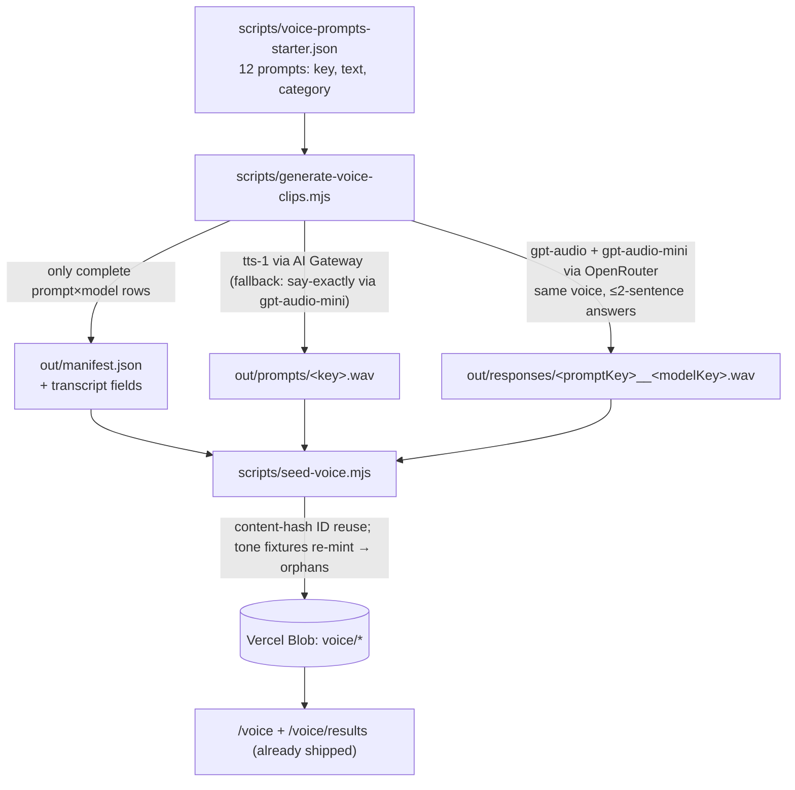

# feat: Voice Arena clip-generation pipeline — real prompts and model responses

## Summary

Add the deferred generation pipeline for the Voice Arena (shipped in PR #54): a script that turns a researcher-authored prompt list into a complete, seedable dataset with real audio — TTS-spoken prompts plus each configured voice model's own spoken answer — and a starter prompt set covering the PRD's categories. Output is a `scripts/seed-voice.mjs`-compatible manifest, so generation → seeding → live arena is one two-command flow. Deploy = code merged dev→main plus one real generation run seeded to the production Blob store and verified live.

## Problem Frame

The arena currently serves tone-WAV fixtures; it cannot answer the PRD's research question until real clips exist. Generating them by hand (record prompts, call each model, arrange files, write the manifest) is error-prone and unrepeatable. The pipeline makes dataset creation reproducible, cached, and cheap to re-run.

---

## Requirements

**Generation**

- R1. `scripts/generate-voice-clips.mjs` reads a prompts JSON (entries: stable `key`, `text`, `category`) and produces, per prompt: one spoken-prompt WAV and, per configured model, one spoken-response WAV (the model's own answer rendered as speech, targeting ≤2 spoken sentences / roughly the PRD's 5–15s).
- R2. Default model pair: `openai/gpt-audio` and `openai/gpt-audio-mini` via OpenRouter chat completions (`modalities: ["text","audio"]`, `audio: {voice, format: "wav"}`), both pinned to the SAME voice (default `alloy`) to control the PRD's voice-identity confound. Models/voice are CLI-configurable; the pair is a deliberate known-direction quality gap that doubles as a method sanity check.
- R3. Spoken prompts are generated with `openai/tts-1` via the AI Gateway speech endpoint; if that endpoint proves unavailable at runtime, fall back to `gpt-audio-mini` with a say-exactly instruction (fallback logged, not silent). Prompt audio uses a DIFFERENT voice than responses so evaluators don't confuse prompt and answer speakers.
- R4. Resumable and cost-bounded: existing VALID output files are skipped (cache validity = size above the WAV header floor AND a RIFF/WAVE header; clips are written to a temp path and renamed on success so an interrupted run cannot poison the cache; `--force` regenerates), API calls get bounded retries with backoff (429/5xx retry, other 4xx fail fast), `--limit N` caps prompts per run. A failed clip never aborts the batch; the manifest includes only prompts with complete prompt×model coverage (incomplete prompts excluded with a warning — partial pairs would skew the arena). Guards: when zero prompts are complete, NO manifest is written; when any generation failed, the seed command is NOT printed — a warning tells the researcher to re-run (cache makes it cheap) before seeding; exit code is non-zero on any failure. The run summary prints generated/skipped(cached)/failed counts, plus per-model average clip duration and RMS level computed from the WAV PCM, flagging a large (>~6 dB) level gap between models (the PRD loudness confound stays visible until normalization lands).
- R5. Output directory (default `voice-dataset/`, a DURABLE, git-committed artifact — it is the only thing preventing a cold-cache re-run from re-minting every ID via nondeterministic regeneration) contains `prompts/<key>.wav`, `responses/<promptKey>__<modelKey>.wav`, and a generated `manifest.json` in the exact input format of `scripts/seed-voice.mjs`. Manifest `file` paths are written relative to the generation-time CWD (they include the out-dir prefix), matching seed-voice's CWD-relative `readFileSync`, and the printed seed command assumes the same CWD. Response entries carry a `transcript` field (the model's answer text); `scripts/seed-voice.mjs`'s `assembleManifest` gets a one-line change to carry `transcript` through to the remote manifest (it rebuilds response objects field-by-field today, so without this the field would be silently dropped), giving researchers stored transcripts (PRD requirement) with no app-side changes.

**Starter prompt set**

- R6. `scripts/voice-prompts-starter.json`: 12 prompts with stable keys and categories covering the PRD's set: factual, short explanation, emotional/empathetic, high-energy, sensitive/serious, pronunciation traps (names, numbers, acronyms — at least two prompts), ambiguous/clarification-needed, concise instruction, storytelling. Texts written as natural spoken requests, not typed queries.

**Non-functional / deploy**

- R7. Plain `.mjs` under `scripts/` with pure exported functions and a thin I/O shell, colocated vitest test, no new dependencies (node built-ins + fetch; keys via `--env-file=.env`). Provider calls in tests use mocked fetch only — no network in unit tests.
- R8. Deploy: code lands via dev→main; one real end-to-end run generates the starter dataset, `scripts/seed-voice.mjs` seeds it to the production Blob store (stable-ID semantics replace the tone fixtures: changed audio under existing keys re-mints IDs; tone-fixture judgments become counted orphans), and production `/voice` + `/voice/results` are verified serving real clips.

---

## Key Technical Decisions

- **OpenRouter `gpt-audio` family for responses**: verified live — the only audio-output chat models reachable with this repo's keys (gateway catalog has TTS models but no OpenAI audio-native chat model; `xai/grok-voice-think-fast-1.0` exists there but its API shape is unverified — noted as config-extensible, not default). One API shape for both models = one client path; same-voice pinning isolates model quality from voice identity.
- **Full-product comparison, model-authored answers**: each model generates its own answer content and speech in one call (PRD's recommended target). Answer-content differences are the point; the diagnostic question in the arena already separates content from delivery.
- **WAV end-to-end**: `gpt-audio` chat completions and `tts-1` both emit WAV natively; seed-voice already uploads `.wav` keys and the fixture player plays WAV. No transcoding, no new dependencies; the only seed-voice change is the one-line `transcript` carry-through in `assembleManifest` (plus its test).
- **Voice-pinning fidelity is verified, not assumed**: if the OpenRouter response echoes the voice used, `parseResponseCompletion` asserts it matches the request and fails loudly on mismatch; if the response carries no voice field, U4's real run records an ear spot-check that both models speak in the pinned voice — same treatment as the tts-1 endpoint uncertainty.
- **File-existence caching as resume**: the output directory IS the cache; re-running skips existing clips. Cheap, inspectable (researcher can listen to files and delete bad ones to regenerate just those), and idempotent with seed-voice's content-hash ID reuse downstream.
- **Generation and seeding stay separate scripts**: generate writes a dataset; the existing seed script publishes it. Composable (researcher can audit clips between steps); the generator prints the exact seed command at the end.
- **Say-exactly fallback for prompt TTS**: the gateway's OpenAI-compatible `/v1/audio/speech` support for `tts-1` is unverified offline (models are listed; endpoint behavior is an execution-time check). The fallback keeps the pipeline single-key-viable and is logged loudly so the researcher knows which path produced prompt audio.

---

## High-Level Technical Design

---

## Scope Boundaries

Out of scope: any UI change (a separate Mobbin-grounded UI refresh is queued next); Bradley–Terry or results changes; latency measurement (PRD evaluates it separately from clip scores); multilingual prompts (starter set is English; the format doesn't preclude adding them).

The generated `voice-dataset/` directory is committed to the repo (roughly 15–20 MB of WAVs at starter scale): it is simultaneously the research artifact, the generation cache, and the only protection against nondeterministic full re-generation re-minting every ID.

### Deferred to Follow-Up Work

- Additional providers (grok-voice via gateway, ElevenLabs, live ASR→LLM→TTS chains) — the models list is CLI-config; adding a provider means one more client function.
- Loudness normalization across models (PRD confound) — revisit if generated clips differ audibly in level; note in the run summary is sufficient for now.
- Prompt-set expansion to the PRD's 100–200 with holdout split — after the method validates on the starter set.

---

## Implementation Units

### U1. Starter prompt set and prompt-file validation

- **Goal:** The researcher-facing input format, a validated starter dataset definition.
- **Requirements:** R6, R1 (input side), R7
- **Dependencies:** none
- **Files:** `scripts/voice-prompts-starter.json`, `scripts/generate-voice-clips.mjs` (validation exports), `scripts/generate-voice-clips.test.ts`
- **Approach:** JSON shape `{prompts: [{key, text, category}]}`. `validatePromptSet(input)`: throws with a clear message on missing/duplicate keys, empty text, unknown top-level shape; warns (returns list) on texts likely to exceed ~15s spoken (>~60 words). 12 starter prompts per R6 — write them as natural speech ("Hey, quick one — what's the tallest mountain in the world?"), including pronunciation traps (e.g. "Siobhan Nguyen", "Worcestershire", "$1,847.03", "the NASA JPL SBIR program") and one sensitive/serious prompt.
- **Patterns to follow:** `scripts/seed-voice.mjs` validateInput (clear thrown messages, Set-based duplicate checks).
- **Test scenarios:**
  - Valid starter file parses and passes validation (load the real file in the test — it is data, keep it honest).
  - Duplicate key, empty text, missing key each throw with the offending entry named.
  - A >60-word text produces a length warning naming the key, but does not throw.
  - Starter set covers every R6 category at least once (test asserts the category set).
- **Verification:** unit tests pass; starter file loads through the real validator.

### U2. Provider clients — audio-response and prompt-TTS calls

- **Goal:** Small, mocked-testable client functions that turn (prompt text, model, voice) into WAV bytes + transcript.
- **Requirements:** R2, R3, R4 (retry side), R7
- **Dependencies:** none (parallel with U1)
- **Files:** `scripts/generate-voice-clips.mjs` (client exports), `scripts/generate-voice-clips.test.ts`
- **Approach:** Pure request-builders separated from fetchers so tests cover shapes without network: `buildResponseRequest(model, voice, promptText)` → OpenRouter chat-completions body (`modalities: ["text","audio"]`, `audio: {voice, format: "wav"}`, system prompt pinning ≤2 spoken sentences); `parseResponseCompletion(json)` → `{wav: Buffer (base64 decode of choices[0].message.audio.data), transcript}` with clear errors on refusals/missing audio; `buildSpeechRequest(text, voice)` → gateway `/v1/audio/speech` body for `tts-1`; say-exactly builder reusing the response path with a "Say exactly the following, with natural delivery — nothing else:" instruction. `withRetry`-style bounded retry (mirror seed-voice's headPollUntilReady bounds + `AbortSignal.timeout`) around each network call; 429/5xx retry, 4xx fail fast.
- **Patterns to follow:** `scripts/seed-voice.mjs` (pure exports + thin I/O, AbortSignal.timeout, clear errors); `lib/storage.ts` retry philosophy.
- **Test scenarios (mocked fetch only):**
  - Response request body carries both modalities, wav format, the configured voice, and the ≤2-sentence system prompt.
  - `parseResponseCompletion` decodes base64 audio to a Buffer whose bytes match, and returns the transcript from the message content/audio transcript field.
  - Completion with no audio (text-only refusal) throws an error naming the model and prompt key context.
  - Retry: 429 then 200 succeeds with one retry; 400 fails immediately without retry; timeout aborts and retries within bounds.
  - Say-exactly builder embeds the prompt text verbatim and the exactness instruction.
  - Voice fidelity: a completion payload echoing a voice that differs from the requested one throws naming both voices; a payload with no voice field passes (U4 covers it by ear).
- **Verification:** unit tests pass; no test opens a network connection.

### U3. Orchestration — cache, batch, manifest assembly, CLI

- **Goal:** The runnable pipeline: prompts file in, dataset directory + seed-ready manifest out — plus the one-line seed-voice transcript carry-through.
- **Requirements:** R1, R4, R5, R7
- **Dependencies:** U1, U2
- **Files:** `scripts/generate-voice-clips.mjs` (orchestrator + main), `scripts/generate-voice-clips.test.ts`, `scripts/seed-voice.mjs` (transcript carry-through in `assembleManifest`), `scripts/seed-voice.test.ts` (one added assertion)
- **Approach:** CLI: `node --env-file=.env scripts/generate-voice-clips.mjs <prompts.json> --out <dir=voice-dataset> [--models a,b] [--voice alloy] [--prompt-voice nova] [--limit N] [--force]`. Plan pure/IO split: `planWork(promptSet, models, cacheProbe)` → list of needed generations, where a cached entry counts only if the existing file passes the validity probe (size above WAV-header floor + RIFF/WAVE magic); main executes sequentially with a small delay, writing each clip to a temp path and renaming on success; `assembleGenerationManifest(promptSet, models, results, outDir)` → seed-voice input manifest (model entries `{key: slugified model id, name: label}`, prompt entries `{key, text, category, file}`, response entries `{prompt, model, file, transcript}`; `file` paths carry the outDir prefix so they resolve from the generation-time CWD, matching seed-voice's CWD-relative reads), EXCLUDING any prompt lacking full model coverage (warning listing exclusions). Guards: zero complete prompts → NO manifest written, distinct error; any failure → seed command NOT printed (warning to re-run instead); exit non-zero. Summary: generated/skipped(cached)/failed per model, per-model average duration and RMS level from the WAV PCM with a >6 dB gap flag, then (only on full success) the exact `seed-voice.mjs` command. seed-voice change: `assembleManifest` response mapping carries `transcript` through; existing seed tests keep passing plus one new assertion that a transcript on an input response lands in the output manifest.
- **Patterns to follow:** `scripts/seed-voice.mjs` main structure and counts printing.
- **Test scenarios:**
  - `planWork`: all-new → full list; valid cached files skipped; a 0-byte or non-RIFF existing file is treated as missing (regenerated); `--force` → full list regardless.
  - `assembleGenerationManifest`: 2 prompts × 2 models all successful → manifest with 2 models/2 prompts/4 responses, correct keys, outDir-prefixed paths, transcripts attached.
  - One prompt missing one model's response → that prompt and its other response excluded, warning lists it, remaining prompt intact.
  - Zero complete prompts → manifest assembly signals refusal (no manifest content produced).
  - `--limit 1` plans only the first prompt's work.
  - Model-id slugging: `openai/gpt-audio-mini` → stable key without `/` (used in filenames and manifest keys).
  - WAV summary math: a synthetic PCM buffer of known amplitude yields the expected RMS/duration; two models with >6 dB delta trip the flag.
  - seed-voice: input response with `transcript` → output manifest response carries it verbatim.
- **Verification:** unit tests pass (including the seed-voice addition); `--limit 1` real run produces 1 prompt WAV + 2 response WAVs + valid manifest that `seed-voice.mjs` validateInput accepts from the repo-root CWD.

### U4. Real-run verification and researcher docs

- **Goal:** Prove the pipeline end-to-end and leave instructions the user can rerun.
- **Requirements:** R8, R3 (fallback decision happens here)
- **Dependencies:** U1–U3
- **Files:** `scripts/generate-voice-clips.mjs` (README-style header comment), `docs/voice-arena-dataset.md`
- **Approach:** Execution-time: run `--limit 1` against real APIs (records which prompt-TTS path worked — gateway `tts-1` or fallback — AND whether the response payload echoes the voice; if not, spot-check by ear that both models speak the pinned voice); full 12-prompt run; commit the `voice-dataset/` output as the durable artifact; `seed-voice.mjs` against the production store; verify production `/voice` serves speech and `/voice/results` reflects the re-minted dataset (orphan count from tone-fixture judgments appears — expected and documented). `docs/voice-arena-dataset.md`: the two-command flow, prompts-file format, cost note, how to add prompts/models, orphan semantics on re-seed, and the durability rule — the dataset directory must be preserved (it is committed) because regeneration is nondeterministic and a cold-cache re-run re-mints every ID, orphaning ALL collected judgments, not just fixtures.
- **Patterns to follow:** seed-voice header-comment style for the script docs.
- **Test scenarios:** Test expectation: none — this unit is the real-API execution and documentation; the automated coverage lives in U1–U3.
- **Verification:** production /voice plays real spoken prompts and responses; results page healthy; docs file present; run summary and seed output captured in the PR description.

---

## Risks & Dependencies

- **OpenRouter `gpt-audio` availability/pricing drift**: verified in the live catalog today; if a model 404s at run time the failure is per-clip, loud, and the models list is CLI-swappable. Cost at starter scale is small (24 short response clips + 12 prompt clips); `--limit` bounds any experiment.
- **Gateway speech-endpoint uncertainty**: `tts-1` is in the gateway catalog but the `/v1/audio/speech` route is unverified — R3's fallback keeps the pipeline functional either way; U4 records which path ran.
- **Refusals/safety behavior on the sensitive prompt**: a model may decline or hedge — that is PRD-relevant signal, not a bug; parse errors only when NO audio is returned (that prompt row then drops per R4 and is reported).
- **Clip length variance**: the ≤2-sentence instruction bounds but doesn't guarantee 5–15s; preserved as natural output per the PRD, with length visible in the run summary (bytes/duration from WAV header).
- **Production re-seed orphans the tone-fixture judgments** (the 6 test votes): expected, counted, and documented — this is the designed behavior for changed audio under stable keys.

## Sources & Research

- Live model catalogs (2026-07-24): AI Gateway `/v1/models` → `openai/tts-1`, `openai/tts-1-hd`, `xai/grok-tts`, `xai/grok-voice-think-fast-1.0` present; OpenRouter `/api/v1/models` → audio-output chat models `openai/gpt-audio`, `openai/gpt-audio-mini` (Lyria music models excluded). These probes are the basis for the provider KTD.
- Env keys available (names): `AI_GATEWAY_API_KEY`, `OPENROUTER_API_KEY`, `POOLSIDE_API_KEY`, `BLOB_READ_WRITE_TOKEN`.
- `scripts/seed-voice.mjs` — input format, validateInput, stable-key + content-hash ID reuse the generator's manifest feeds into. Verified: `assembleManifest` rebuilds response entries field-by-field (no spread), so the `transcript` carry-through in R5 requires the stated one-line change; manifest `file` paths are read relative to the process CWD (`readFileSync(r.file)` with no dirname join), which R5's path contract matches.
- `docs/plans/2026-07-24-001-feat-voice-arena-poc-plan.md` — the shipped arena this dataset feeds; PRD categories and the 5–15s clip guidance carried from the original PRD conversation.
